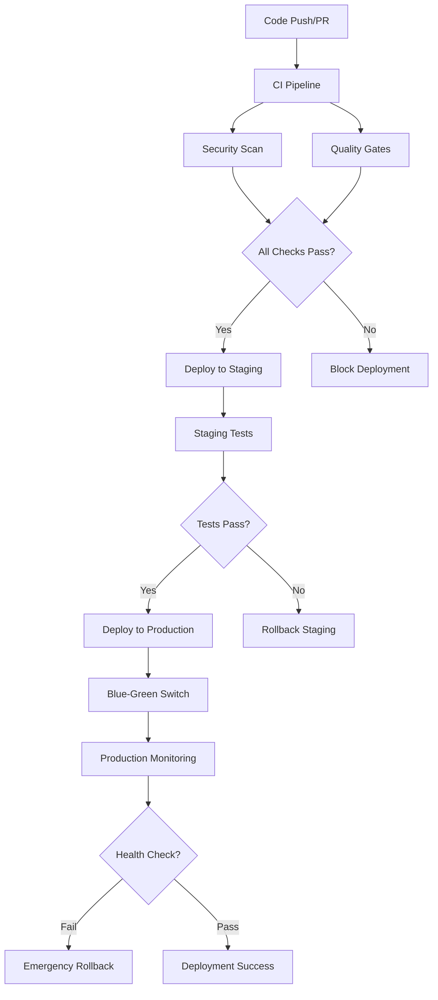

# CI/CD Pipeline Documentation

This document provides a comprehensive overview of the CI/CD pipeline implementation for the Slack Clone application.

## Overview

The CI/CD pipeline is built using GitHub Actions and implements DevOps best practices including:

- Continuous Integration with automated testing
- Progressive deployment (staging → production)
- Blue-green deployment strategy
- Comprehensive security scanning
- Performance monitoring and alerting
- Automated release management

## Pipeline Architecture



## Workflows

### 1. Continuous Integration (`ci.yml`)

**Triggers:** Push to main/develop, Pull requests to main

**Features:**
- Multi-service testing (PostgreSQL, Redis, Elasticsearch)
- Comprehensive test suite with coverage reporting
- Static code analysis (Credo, Dialyzer)
- Security dependency scanning
- Performance benchmarking
- Quality gate enforcement

**Services:**
```yaml
services:
  postgres: postgres:14
  redis: redis:7
  elasticsearch: elasticsearch:8.5.0
```

**Quality Thresholds:**
- Test coverage: >80%
- Response time: <500ms (95th percentile)
- Error rate: <1%
- Security vulnerabilities: None (high/critical)

### 2. Staging Deployment (`deploy-staging.yml`)

**Triggers:** Push to develop branch

**Features:**
- Docker image building and signing with Cosign
- Kubernetes deployment to staging namespace
- Database migrations
- Health checks and smoke tests
- Automatic rollback on failure
- Slack notifications

**Deployment Strategy:**
- Rolling update with zero downtime
- Health checks before traffic switching
- 5-minute monitoring window

### 3. Production Deployment (`deploy-production.yml`)

**Triggers:** Git tags (v*), Manual workflow dispatch

**Features:**
- Pre-deployment validation checks
- Blue-green deployment strategy
- Database migration with rollback capability
- Comprehensive monitoring and alerting
- Emergency rollback procedures

**Blue-Green Process:**
1. Deploy to Blue environment
2. Run health and performance checks
3. Switch traffic from Green to Blue
4. Monitor for issues
5. Scale down Green environment

### 4. Security Scanning (`security.yml`)

**Triggers:** Weekly schedule, Push to main, Pull requests

**Security Tools:**
- **Dependency Scanning:** OWASP Dependency Check, Hex Audit
- **Code Analysis:** CodeQL, Semgrep
- **Secret Detection:** TruffleHog, GitLeaks
- **Container Scanning:** Trivy, Snyk
- **Infrastructure:** Checkov, Kubesec

**Compliance:**
- OWASP Top 10 coverage
- SARIF result uploads to GitHub Security
- Automated security issue creation

### 5. Performance Monitoring (`performance.yml`)

**Triggers:** Push to main/develop, Pull requests, Every 6 hours

**Performance Tests:**
- **Load Testing:** K6-based load tests with realistic scenarios
- **Memory Profiling:** Elixir memory analysis
- **Database Performance:** Query optimization checks
- **Lighthouse:** Frontend performance auditing
- **Benchmark Comparison:** PR vs main performance comparison

**Metrics Tracked:**
- Response time percentiles
- Throughput (requests/second)
- Memory usage
- Database query performance
- Frontend Core Web Vitals

### 6. Release Automation (`release.yml`)

**Features:**
- **Semantic Release:** Automated version bumping based on commit messages
- **Manual Release:** Workflow dispatch with version control
- **Asset Building:** Optimized production builds
- **GitHub Releases:** Automated release notes and asset publishing
- **Changelog Generation:** Automatic changelog updates

**Release Types:**
- `patch`: Bug fixes (0.0.X)
- `minor`: New features (0.X.0)
- `major`: Breaking changes (X.0.0)
- `prerelease`: Alpha, beta, RC versions

### 7. PR Checks (`pr-checks.yml`)

**Features:**
- PR title format validation
- Automated labeling based on changed files
- Code quality metrics reporting
- Dependency review
- Bundle size monitoring
- Accessibility testing
- Auto-reviewer assignment

### 8. Monitoring (`monitoring.yml`)

**Triggers:** Every 15 minutes, Manual dispatch

**Monitoring Checks:**
- Application health endpoints
- API connectivity
- WebSocket functionality
- SSL certificate expiration
- Performance metrics
- Error rate monitoring
- Multi-region availability

**Alerting:**
- **Critical:** Immediate Slack + GitHub issue + email
- **High:** Slack notification
- **Medium:** Monitoring channel notification

## Quality Gates

### Code Quality
- ✅ All tests pass
- ✅ Code coverage >80%
- ✅ Credo analysis passes
- ✅ Dialyzer type checking passes
- ✅ Code formatting compliant

### Security
- ✅ No high/critical security vulnerabilities
- ✅ Secret scanning passes
- ✅ Container security scan passes
- ✅ Dependency security audit passes

### Performance
- ✅ Response time <500ms (95th percentile)
- ✅ Error rate <1%
- ✅ Memory usage within limits
- ✅ No performance regressions >10%

## Deployment Environments

### Staging
- **URL:** https://slack-clone-staging.yourdomain.com
- **Purpose:** Integration testing, feature validation
- **Resources:** 2 replicas, 512Mi memory limit
- **Database:** Separate staging database
- **Monitoring:** Basic health checks

### Production
- **URL:** https://slack-clone.yourdomain.com
- **Purpose:** Live application serving users
- **Resources:** 3 replicas, 1Gi memory limit
- **Database:** Production database with backups
- **Monitoring:** Comprehensive monitoring and alerting

## Container Strategy

### Multi-stage Dockerfile
1. **Builder stage:** Elixir/OTP with build dependencies
2. **Asset compilation:** Frontend assets and optimization
3. **Release stage:** Minimal runtime image with compiled release

### Security Features
- Non-root user execution
- Read-only root filesystem
- Dropped capabilities
- Health checks included
- Distroless-style minimal image

## Kubernetes Configuration

### Staging Configuration
- **Namespace:** slack-clone-staging
- **Replicas:** 2
- **Resources:** 256Mi-512Mi memory, 100m-500m CPU
- **Strategy:** Rolling update

### Production Configuration
- **Namespace:** slack-clone-blue/green
- **Replicas:** 3
- **Resources:** 512Mi-1Gi memory, 200m-1000m CPU
- **Strategy:** Blue-green deployment
- **Affinity:** Pod anti-affinity for high availability

## Monitoring and Observability

### Metrics Collection
- **Application:** Phoenix LiveDashboard + Telemetry
- **Infrastructure:** Kubernetes metrics
- **Custom:** Business metrics via Telemetry

### Logging
- **Format:** JSON structured logging
- **Aggregation:** Centralized log collection
- **Retention:** 30 days

### Alerting Rules
- **Response Time:** >500ms sustained for 5 minutes
- **Error Rate:** >5% for 2 minutes
- **Memory Usage:** >80% for 10 minutes
- **CPU Usage:** >80% for 10 minutes
- **Health Check:** Failed health checks for 3 consecutive checks

## Security Configuration

### Secrets Management
- Kubernetes secrets for sensitive data
- Environment-specific secret stores
- Automatic secret rotation policies

### Network Security
- TLS termination at ingress
- Internal service mesh encryption
- Network policies for namespace isolation

### Image Security
- Image signing with Cosign
- Regular base image updates
- Vulnerability scanning in CI/CD

## Backup and Recovery

### Database Backups
- Daily automated backups
- Point-in-time recovery capability
- Cross-region backup replication

### Application Recovery
- Blue-green deployment enables instant rollback
- Database migration rollback procedures
- Configuration rollback via Git

## Troubleshooting

### Common Issues

**1. Build Failures**
```bash
# Check build logs
kubectl logs -n slack-clone-staging deployment/slack-clone

# Debug locally
docker build -t slack-clone:debug .
docker run -it slack-clone:debug /bin/bash
```

**2. Deployment Failures**
```bash
# Check deployment status
kubectl describe deployment slack-clone -n slack-clone-staging

# Check pod events
kubectl get events -n slack-clone-staging --sort-by='.lastTimestamp'
```

**3. Performance Issues**
```bash
# Check resource usage
kubectl top pods -n slack-clone-production

# View metrics
kubectl port-forward svc/slack-clone 4000:4000
curl http://localhost:4000/metrics
```

### Emergency Procedures

**1. Emergency Rollback**
```bash
# Rollback to previous version
kubectl rollout undo deployment/slack-clone -n slack-clone-production

# Check rollback status
kubectl rollout status deployment/slack-clone -n slack-clone-production
```

**2. Scale Up During High Load**
```bash
# Scale up replicas
kubectl scale deployment slack-clone --replicas=5 -n slack-clone-production
```

**3. Database Issues**
```bash
# Check database connectivity
kubectl exec -it deployment/slack-clone -n slack-clone-production -- mix ecto.migrate
```

## Best Practices

### Development Workflow
1. Create feature branch from develop
2. Implement changes with tests
3. Create pull request
4. Automated PR checks run
5. Code review and approval
6. Merge to develop → staging deployment
7. Staging testing and validation
8. Merge to main → production deployment

### Commit Message Format
```
type(scope): subject

body

footer
```

**Types:** feat, fix, docs, style, refactor, perf, test, chore, ci, build

### Release Strategy
- **Hotfixes:** Direct to main with patch version
- **Features:** develop → main with minor version
- **Breaking changes:** Coordinated major version release

## Maintenance

### Regular Tasks
- [ ] Weekly dependency updates review
- [ ] Monthly security scan results review
- [ ] Quarterly disaster recovery testing
- [ ] Performance baseline updates
- [ ] SSL certificate renewal monitoring

### Monitoring Reviews
- Daily: Check critical alerts and system health
- Weekly: Review performance trends and capacity
- Monthly: Analyze security posture and updates needed

## Configuration Files

Key configuration files in this setup:

- `.github/workflows/ci.yml` - Main CI pipeline
- `.github/workflows/deploy-staging.yml` - Staging deployment
- `.github/workflows/deploy-production.yml` - Production deployment  
- `.github/workflows/security.yml` - Security scanning
- `.github/workflows/performance.yml` - Performance testing
- `.github/workflows/release.yml` - Release automation
- `.github/workflows/pr-checks.yml` - Pull request validation
- `.github/workflows/monitoring.yml` - System monitoring
- `Dockerfile` - Container build configuration
- `k8s/` - Kubernetes manifests
- `.github/dependabot.yml` - Dependency management
- `SECURITY.md` - Security policy
- `.lighthouserc.js` - Performance testing config

This comprehensive CI/CD pipeline ensures reliable, secure, and performant deployments while maintaining high development velocity and system observability.